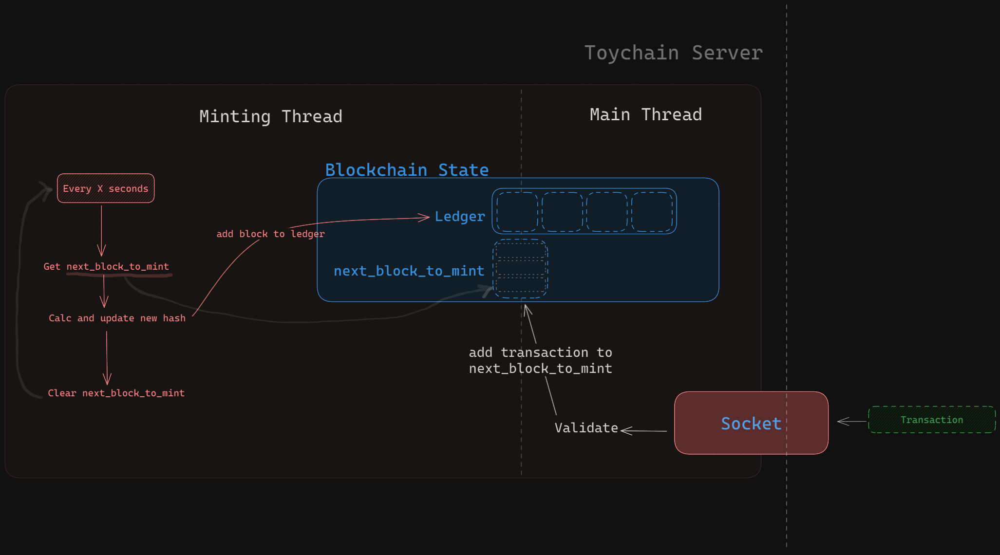

# ToyChain

<!-- TOC -->
* [ToyChain](#toychain)
  * [How it works](#how-it-works)
  * [How to use](#how-to-use)
    * [start-node](#start-node)
    * [create-account](#create-account)
    * [transfer](#transfer)
    * [balance](#balance)
  * [Project Structure](#project-structure)
<!-- TOC -->

ToyChain is a simple Client-Server blockchain implementation in Rust.

## How it works

ToyChain is a simple blockchain implementation that uses a client-server architecture. The server node listens for
operation requests from clients and processes them.
A requested operation could result in a transaction being added to the blockchain or a response being sent back to the
client.

The server is multi-threaded, one thread handles communication with clients and the other thread handles minting new
blocks.



The server takes care of the following aspects of the blockchain:

- Minting new blocks
- Adding transactions to the blockchain
- Validating transactions
- Querying the blockchain

## How to use

Toychain can be used as a blockchain server or as a client to interact with the blockchain server.

The following commands are available:

```
Commands:
  start-node      Start a ToyChain server node
  create-account  Create an account on Toychain
  transfer        Transfer funds between accounts on Toychain
  balance         Get the balance of an account on Toychain
  help            Print this message or the help of the given subcommand(s)
```

### start-node

Starts a ToyChain server node on port 1337. The server node will listen for incoming operations from clients.
Some example operations are:

- Create an account
- Transfer funds between accounts
- Get the balance of an account

Other commands are used by clients to interact with the server node by sending operations.

### create-account

Sends a create account operation to the server node. Which will create a transaction on the blockchain to create an
account.
Example:

```
$ toychain create-account Alice 100
# Node ID: DESKTOP-8C6MU5G  (This is the node ID of the requestor which will be used in the transaction)
# Request sent to server.
# Response from server: ✅ Transaction to create account mama with balance 100 committed.
```

This will post a transaction like this to the blockchain:

```
Transaction {
    node_id: DESKTOP-8C6MU5G,
    from: None, // None because this is a create account operation
    to: "Alice",
    amount: 100,
    datetime: 2021-10-10T20:00:00Z,
}
```

### transfer

Sends a transfer operation to the server node. Which will create a transaction on the blockchain to transfer funds
between accounts.
Example:

```
$ toychain transfer Alice Bob 50
# Node ID: DESKTOP-8C6MU5G  (This is the node ID of the requestor which will be used in the transaction)
# Request sent to server.
# Response from server: ✅ Transaction to transfer 100 from Alice to Bob committed.
```

This will post a transaction like this to the blockchain:

```
Transaction {
    node_id: DESKTOP-8C6MU5G,
    from: "Alice",
    to: "Bob",
    amount: 50,
    datetime: 2021-10-10T20:00:00Z,
}
```

### balance

Sends a balance operation to the server node. Which will return the balance of the account by querying the blockchain.
Example:

```
$ toychain balance Alice
# Node ID: DESKTOP-8C6MU5G  (This is the node ID of the requestor which will be used in the transaction)
# Request sent to server.
# Response from server: Account Alice has a balance of 200.
```

This will look at all the transactions on the blockchain and calculate the balance of the account.
For this example, we use a simple list data structure to store the transactions. In a real-world scenario, we would use
a more efficient data structure like a Merkle tree.

## Project Structure

The code is split into 3 files:

- `main.rs`: Contains the main function that parses the command line arguments and calls the appropriate function. Acts
  as one-shot client.
- `server.rs`: Contains the server blockchain implementation.
- `common.rs`: Contains the common data structures used by the server and client.
